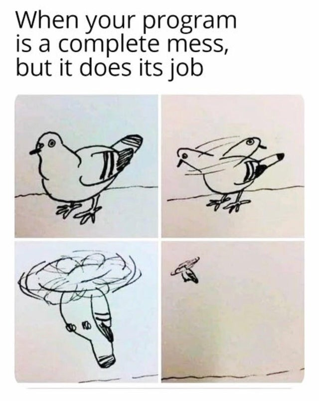

# 👋 Hi, I'm Adrian.

I've been **programming as a hobby** for around 10 years at this point. It all began with a little bit of modding for Skyrim and now I'm here, enjoying my time and creating shitty **Scripting Languages** that nobody will (*and nobody should*) ever use.  

## ✅ Interests

* **Language Design**
* Compilers and Interpreters
* API Design in Libraries & Frameworks
* Tooling and Automation
* Game Development
* GUI Applications
* Philosophy

## ❌ Please No

* Functional Programming (I suffer from Skill Issues)
* Excessive Abstractions (I am not working in Enterprise)

## 💡 Knowledge

> **"I know that I know nothing."** - Socrates

Throughout the years, I've poked with too many languages and technologies to track and I also don't believe in lists of buzzwords providing any meaningful value. I'd rather write down a little paragraph.

There's a warm place in my heart for C# and the .NET Ecosystem, but I'm enjoying all kinds of languages, including but not restricted to C, C++, Python, JavaScript or even languages not labeled with the term 'programming', e.g. HTML and CSS.

On top, I 've been using the Unity Game Engine since the days of Unity 5 and i have some *pretty basic* expertise in Graphics Design and UX, I've actually done a lot of different kinds of art in my life.  

## 🤔 About Me

> **"Don't take yourself too seriously."** - Me

* Cynic
* Introvert
* Overthinker 

I also like cats, little furry scumbags.  
Am not fun at parties, but I don't visit them in the first place.

There's also a [YouTube Channel](https://www.youtube.com/@wtch28) with mediocre content and infrequent uploads.

## 🤷‍♂️ Where Repositories?

Well, jokes on you, they're all **private**.  
If I ever feel like one of my projects can provide value to a bigger audience than myself, i'll happily share them, but I don't see any value in flooding GitHub with additional useless public repositories. We're not putting every small life decision in our CVs, so why would we put every small line of code in a public repository?

----
## 🦖 The Truth

---

> Thank you for reading and I'm sorry if anybody feels offended by the way I phrased my README, but there's enough of soullessness in todays world and I'd rather be accepted for who I am, not for what I can pretend to be.
